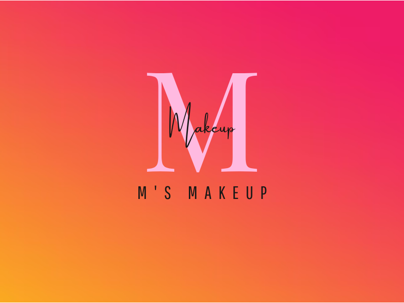

# M'sMakeup
A melhor make é aquela que combina com você! Seja basiquinha ou cheia de vida, o estilo certo é você quem faz. Aqui na M's Makeup é o lugar ideal para achar seu estilo e ser quem vc deseja!

## Requisitos

Certifique-se de ter os seguintes requisitos atendidos antes de começar a trabalhar nos exercícios:

- PHP instalado
- Composer instalado
- Laravel Framework instalado
- 7-Zip instalado
- Git instalado
- Editor de código de sua preferência

## Como utilizar este repositório

1. Clone este repositório para o seu ambiente de desenvolvimento local utilizando o comando:
```
 git clone https://github.com/marileoncio/MsMakeup-api.git
```
2. Iniciando o Repositório
```
Iniciando o Repositório
```
3. Copiando o .env do exemplo
```
copy .env.exemple .env
```
4. Acesse o diretório do projeto:
```
cd m'sMakeup-api
```
5. Acessar o Visual Studio Code
```
code .
```

# Insomnia
[](https://insomnia.rest/run/?label=M's%20Makeup&uri=https%3A%2F%2Fraw.githubusercontent.com%2Fmarileoncio%2FMsMakeup-api%2Fmain%2Finsomnia.json%3Ftoken%3DGHSAT0AAAAAACGBYKE7BQSDA2BESPD2XNVQZGSFXXQ)

## Licença

Este projeto está licenciado sob a [MIT License](LICENSE), o que significa que você pode utilizá-lo livremente para fins educacionais, comerciais ou pessoais.

## Contato

Em caso de dúvidas, sugestões ou problemas, sinta-se à vontade para entrar em contato através do email: mariana.timoteo19@yahoo.com

[](https://insomnia.rest/run/?label=M's%20Makeup&uri=https%3A%2F%2Fraw.githubusercontent.com%2Fmarileoncio%2FMsMakeup-api%2Fmain%2Finsomnia.json%3Ftoken%3DGHSAT0AAAAAACGBYKE7BQSDA2BESPD2XNVQZGSFXXQ)